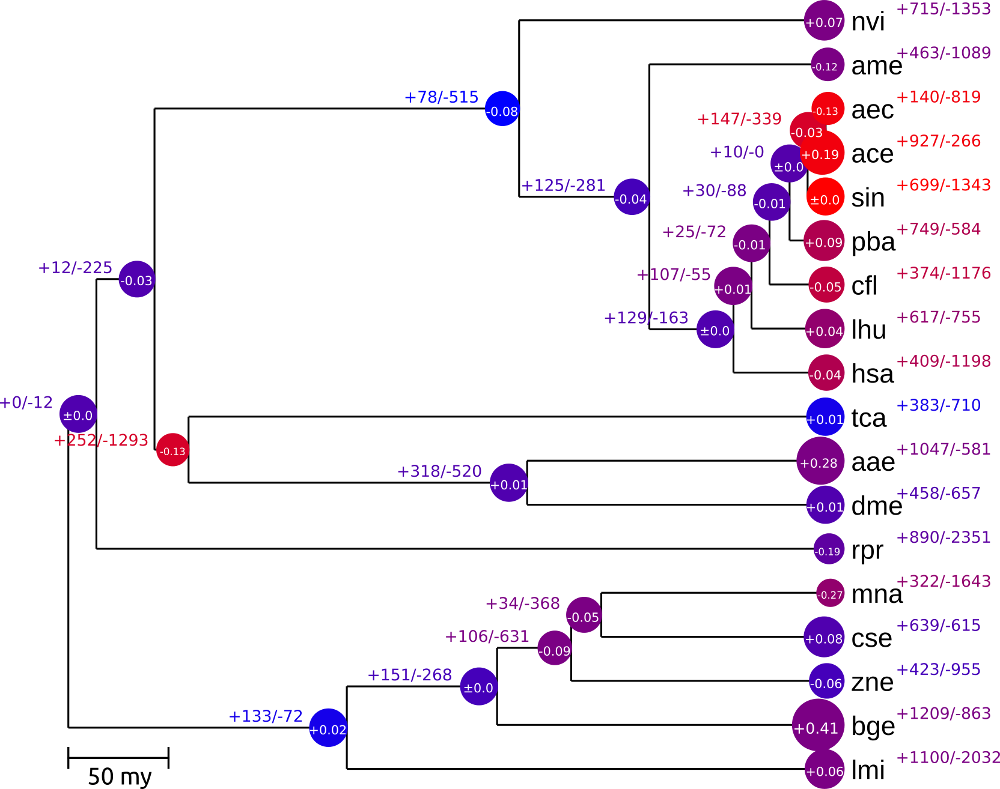
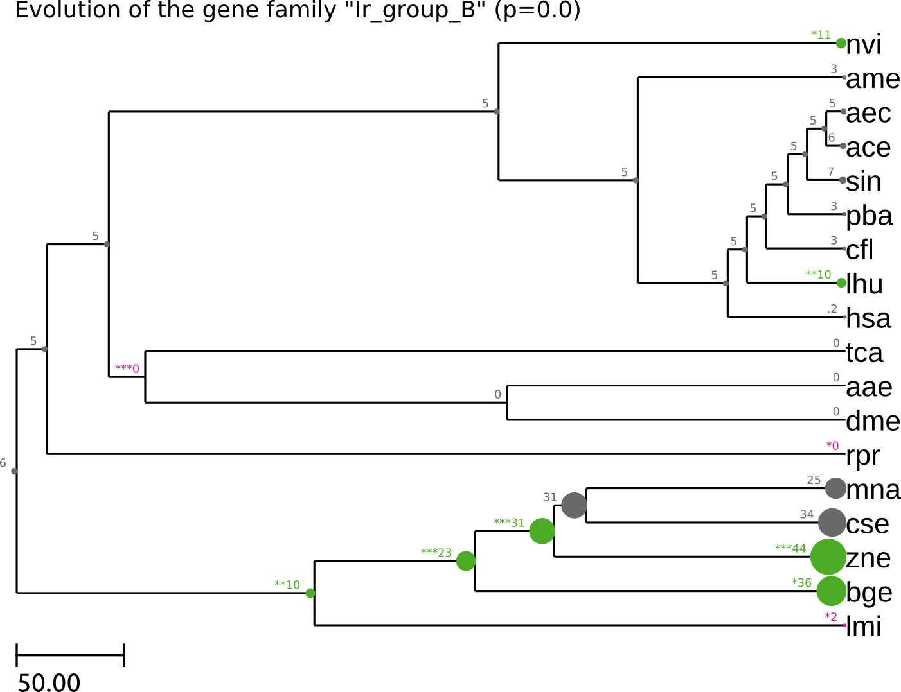

CAFE_fig, a visualization tool for CAFE.
=========

[CAFE](https://hahnlab.github.io/CAFE/) (Computational Analysis of gene Family
Evolution) is a software that provides a statistical foundation for evolutionary
inferences about changes in gene family size.

The visualization and interpretation of CAFE results usually requires custom
scripts. Here, I provide such a custom script.

CAFE_fig takes a .cafe output file and produces:
- a summary tree that shows the average expansion/contraction of families across the phylogeny
- a tree that denotes which branches evolve under which lambda (if a model with multiple lambdas was used)
- a tree for each family of interest, i.e. families that the user specified by ID or families that showed significant change at a user-specified clade of interest


Requirements
------------


CAFE_fig requires Python3.4+ and ETE3:
Install ETE3 with

`pip3 install 'ete3==3.0.0b35'`

It's important that you use ETE3 version 3.0.0b35 since it appears that the latest ETE3 version causes problems that are bejony my control (see issue [#1](https://github.com/LKremer/CAFE_fig/issues/1)).


Usage
------------

```
usage: CAFE_fig.py [-h] [-f FAMILIES [FAMILIES ...]] [-c CLADES [CLADES ...]]
                   [-pb PB] [-pf PF] [-d DUMP] [-g GFX_OUTPUT_FORMAT]
                   report_cafe

Parses a CAFE output file (.cafe) and plots a summary tree that shows the
average expansion/contraction across the phylogeny, the numbers of expanded/
contracted families, and the estimated lambda rates (rate of gene gain/loss).
Can also plot a separate, detailed tree that shows the evolution of a single gene
family's size for each user-specified gene family.

positional arguments:
  report_cafe           the file report.cafe (or similar name)

optional arguments:
  -h, --help            show this help message and exit
  -f FAMILIES [FAMILIES ...], --families FAMILIES [FAMILIES ...]
                        only show families with these IDs
  -c CLADES [CLADES ...], --clades CLADES [CLADES ...]
                        only show families that are expanded/contracted at
                        this clade. Format: [clade]=[leaf],[leaf] where clade
                        is the name of the last common ancestor of the two
                        leaves, e.g.: Isoptera=zne,mna
  -pb PB                branch p-value cutoff (default: 0.05)
  -pf PF                family p-value cutoff (default: 0.05)
  -d DUMP, --dump DUMP  don't open trees in a window, write them to files in
                        the specified directory instead (default: off)
  -g GFX_OUTPUT_FORMAT, --gfx_output_format GFX_OUTPUT_FORMAT
                        output format for the tree figures when using --dump
                        [svg|pdf|png] (default: pdf)
```

Example usage
------------

`./CAFE_fig.py example_result.cafe -c Isoptera=zne,mna -a 0.05 --dump test/ -g .pdf`

Reads "example_result.cafe" and dumps all figures in PDF format to the directory "test/". Trees will only be shown for families that showed a significant (p<=0.05) expansion/contraction at the node "Isoptera", which is the last common ancestor of "zne" and "mna".

Significant contractions are marked in magenta, significant expansions are marked in green (p<=0.001 = \*\*\*, p<=0.01 = \*\*, p<=0.05 = \*).


Example outputs
------------

Summary tree that shows the average expansion/contraction (radius of node circles),
the numbers of expanded/contracted families (+/-), and the estimated gene gain/loss
rates (blue: low rate; red: high rate).


Example output for a specific gene family. Numbers and node sizes represent the family size at each node.
Significant expansions are shown in green, significant contractions in magenta.

